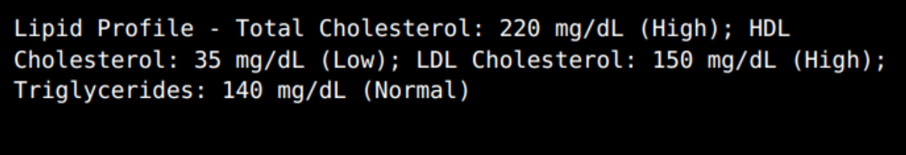
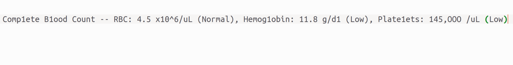
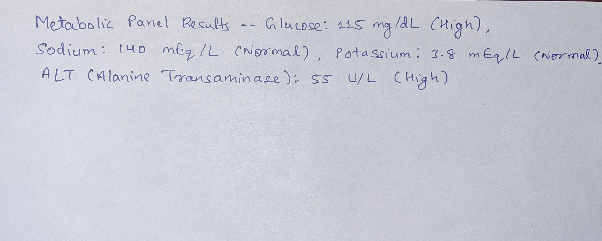

# AI-Powered Medical Report Simplifier


A production-ready backend service that takes a medical report (as text or an image), analyzes it using a multi-step AI pipeline, and returns a structured, patient-friendly summary. This project was built as a submission for the Plum SDE Intern assignment.

**Live Demo Endpoint:** `https://care-simplifier.onrender.com`

---
## The Journey: From Problem to Solution

This project was built iteratively to solve the complex problem of simplifying medical reports. The development process focused on creating a robust, resilient, and intelligent service that could handle the ambiguities of real-world data.

1.  **Initial Ideation:** The goal was to create an API that could translate medical jargon. The initial design was a simple two-step AI pipeline: one call to structure the data and a second to summarize it.

2.  **Building the Core Pipeline:** A multi-step pipeline was designed using Google Gemini. The first AI call normalizes the data into a structured format, and the second, using an advanced **few-shot prompt**, translates that structured data into a patient-friendly summary.

3.  **Developing a Robust Guardrail:** Early testing revealed that a simple validation check was insufficient for handling messy OCR text. The validation logic evolved significantly:
    * It started as a basic string search (`.includes()`).
    * This failed on minor typos, so it was upgraded to use the **Levenshtein distance** algorithm to calculate a similarity score.
    * This was still flawed, as comparing a short word to a long text block yielded poor results.
    * The final, most robust solution was implemented: a **sliding window algorithm** that calculates the Levenshtein similarity between the AI's output and all relevant substrings of the source text. This provided a highly accurate and resilient guardrail against AI hallucinations.

4.  **Production Hardening:** Finally, the service was enhanced with production-grade features, including automatic retries with exponential backoff to handle temporary API failures, image pre-processing to improve OCR accuracy, rate-limiting to prevent abuse, a CORS policy for security, and full containerization with Docker.

---
## Features

-   **Dual Input:** Accepts both raw text and image (`.png`, `.jpg`) uploads.
-   **Advanced OCR:** Utilizes **Tesseract.js** with **Sharp** for image pre-processing (grayscale, normalization, sharpening) to improve text extraction accuracy from low-quality images.
-   **Intelligent AI Normalization:** Employs the **Google Gemini API** to convert raw text into structured JSON, including inferring standard medical reference ranges not present in the source text.
-   **Algorithmic Guardrail:** A sophisticated validation service using a **sliding window** and the **Levenshtein distance** algorithm calculates a confidence score to prevent AI hallucinations, ensuring the AI's output is grounded in the source text.
-   **Resilient API:** Automatically retries failed API calls to Google's servers with **exponential backoff**.
-   **Production Ready:** Secured with rate-limiting, configured with a CORS policy, fully containerized with **Docker**, and includes a health-check endpoint.

---
## Technology Stack

-   **Backend:** Node.js, Express.js
-   **AI:** Google Gemini API (`@google/generative-ai`)
-   **OCR:** Tesseract.js
-   **Image Processing:** Sharp
-   **Deployment:** Docker, Render
-   **Utilities:** Multer, Express Rate Limit, CORS

---
## API Documentation

**Endpoint:** `POST /api/v1/simplify-report`
**Request Body:** `multipart/form-data`

-   `file` (file, optional): An image of the medical report.
-   `text` (string, optional): The raw text of the medical report.

*(Note: Provide either `file` or `text`. If both are provided, `file` takes precedence.)*

---
## Postman Guide

Simple guide to test the API using Postman.

### Testing with Text Input
1.  Set the method to **POST**.
2.  Enter the request URL: `https://care-simplifier.onrender.com/api/v1/simplify-report` (or `http://localhost:8000/api/v1/simplify-report` for local testing).
3.  Go to the **Body** tab and select **form-data**.
4.  In the `KEY` column, enter `text`.
5.  In the `VALUE` column, paste the medical report text.
6.  Click **Send**.

### Testing with Image Input
1.  Follow steps 1-3 from the text input guide.
2.  In the `KEY` column, enter `file`.
3.  On the right side of the `KEY` field, a dropdown will say "Text". Click it and change it to **"File"**.
4.  The `VALUE` column will now show a "Select Files" button. Click it and choose your image.
5.  Make sure any `text` fields are unchecked.
6.  Click **Send**.

---
## Prerequisites, Setup, and Usage

### Prerequisites

#### 1. Node.js (v18 or higher)
It's recommended to use **Node Version Manager (nvm)** to install and manage Node.js.
-   [Install nvm by following these instructions.](https://github.com/nvm-sh/nvm#installing-and-updating)
-   Once installed, run the following commands:
    ```bash
    nvm install 18
    nvm use 18
    ```

#### 2. Docker
Docker is required for the containerized setup. [Install Docker here.](https://docs.docker.com/engine/install/)

#### 3. Gemini API Key
This project requires a Google Gemini API key.
1.  Go to **[Google AI Studio](https://aistudio.google.com/)**.
2.  Sign in with your Google account.
3.  Click on **"Get API key"** in the top left menu.
4.  Click **"Create API key in new project"**.
5.  Copy the generated API key and save it securely.

### Local Setup

1.  **Clone the repository:** `git clone https://github.com/SahillRazaa/plum--7-AI-Powered-Medical-Report-Simplifier.git`
2.  **Install dependencies:** `npm install`
3.  **Set up environment variables:** Create a `.env` file (using `.env.example` as a template) and add your Gemini API Key.
4.  **Run the server:** `npm run dev`

### Docker Setup

1.  **Build the Docker image:** `docker build -t care-simplifier .`
2.  **Run the Docker container:** `docker run -p 8000:8000 -e GEMINI_API_KEY="YOUR_API_KEY" care-simplifier`

---
## Rigorous Testing Strategy

The application was tested against a wide variety of inputs to ensure robustness.

### AI Logic & Edge Case Testing

| Test Case                 | Input Example                                                    | Expected Behavior                                                                         |
| ------------------------- | ---------------------------------------------------------------- | ----------------------------------------------------------------------------------------- |
| **Noisy OCR Simulation** | `"Hem globin 1O.2 g/dL (Low), WBC 11,2OO /uL (Hgh)"`               | AI correctly interprets typos and returns a clean, structured result.                     |
| **All Normal Results** | `"Thyroid Panel: TSH 2.5 mIU/L (Normal)"`                          | AI provides a reassuring summary specifically for when all results are normal.            |
| **No Medical Data** | `"This is a test of the system."`                                  | The service gracefully returns a message that no valid medical data was found.             |
| **Missing Status Info** | `"Metabolic Panel: Glucose 95 mg/dL, Potassium 4.1 mEq/L"`         | AI uses its knowledge to correctly determine the status ("Normal") for each test.         |

### OCR Robustness Testing

| Test Case             | Test Image                                                                                                | Purpose                                                                               |
| --------------------- | --------------------------------------------------------------------------------------------------------- | ------------------------------------------------------------------------------------- |
| **High Quality** |                                | Establishes a baseline with a clean, high-contrast, typed-text image.                 |
| **Good Quality** |                                | Establishes a baseline with a clean, high-contrast, typed-text image.                 |
| **Handwritten Text** |                                 | The ultimate stress-test for the OCR and pre-processing pipeline.                     |

---
## Future Work

While this project is a complete and robust service, there are several exciting directions for future development:

-   **Database Integration:** Incorporate a database like PostgreSQL to securely store user reports, allowing for historical tracking of medical results.
-   **Frontend User Interface:** Develop a simple React-based frontend to provide a more intuitive user experience for uploading reports and viewing results.
-   **User Authentication:** Implement a secure authentication system (e.g., JWT) to protect user data and manage access.
-   **Batch Processing:** Add the capability to upload and process multiple reports in a single batch job.

---
